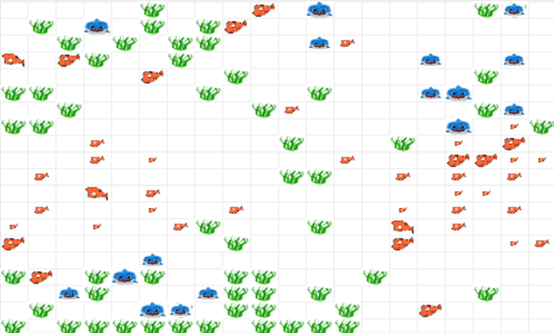
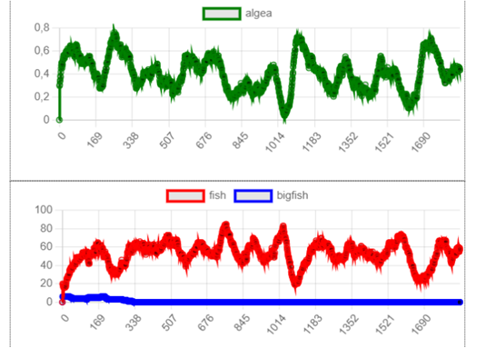
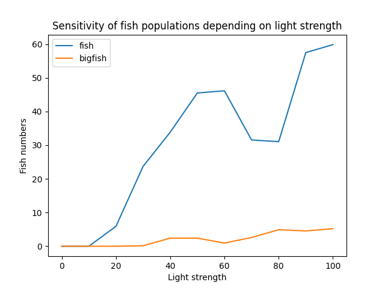

# project - Ilona Willemse fishtank
This code creates a situation that visualises a fishtank within an animation.

```
The fish move can swim, reproduce and eat algea. They stop eating the algea when they are full. Algea can expand it's population by appearing randomly by chance. Big fish are added and eat the smaller fish. Both fish have the ability to grow as they get older.
```





## How to run

```
$ python3 fish.py
```

# General idea

- Fish
    - [x] swim in a fishtank
    - [x] through swimming energy level goes down
    - [x] energy can be obtained by eating algea
    - [x] with energy fish can mate and bare children
    - [x] fish die when no more energy
    - [x] fish die also when too old
    - [x] the fish stop eating the algea when they're full
    - [x] the fish do grow when they get older
    - [x] the second bigger type of fish does not eat algea but eats the smaller fish instead
    - [x] fish only mate with the same type of fish

- algea
    - [x] can grow randomly by chance which is affected by the light strength.
    - [x] number gets reduced by fish that eat algea.

- input
    - [x] light strength

- output
    - [x] a live fish and algea counting is shown together with the fishtank animation to keep track of the populations inside the fishtank

- end goal
    - [x] visualise how different fish populations are influenced by light strength

## research question
what influence does the light strength have on the population of fish in a fishtank?


```
conclusion: The more light the more algea growth the more the fish can eat. More eating means more energy so more fish are presented in the fishtank. For the second range of fish which only eat the smaller other species of fish, their populations grows too with more light. This is because there are more fish inside the tank which they can eat and therefore reproduce more.
```


## libraries
```
import numpy as np
import matplotlib.pyplot as plt
from mesa import Agent, Model
from mesa.time import RandomActivation
from mesa.space import MultiGrid
from mesa.visualization.modules import CanvasGrid
from mesa.visualization.ModularVisualization import ModularServer
from mesa.visualization.modules import ChartModule
from mesa.datacollection import DataCollector
import statistics

```

## limitations that could come up
- not being able to insert an image inside the animation instead of a square
- not being able to let the fish grow
- adding the slides can be tough
- because i cannot use plt.show() it will be hard to visualize the animation if i let it run forever

## inspiration
```
https://docplayer.nl/161846295-Agent-based-modeling-domein-r-computational-science.html

credits to:
mesa introdyctory tutorial
mesa advanced tutorial

with the help of Mesa I was able to implement some really cool properties of the fishtank

```
