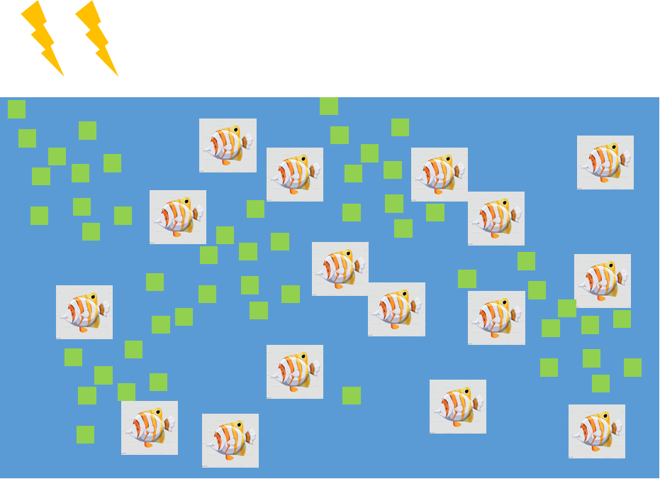

# project-ilona willemse fishtank
This code creates a situation that visualises a fishtank within an animation.



## How to run

```
$ python3 fish.py
```


## Testing (not sure yet if i'm going to implement this because of time)

To test the implementation simply run `pytest` in the root folder of the project.

```
pytest
```

# General idea

- Fish
    - [] swim in a fishtank.
    - [] will get tired through swimming.
    - [] energy can be obtained by eating algea.
    - [] with energy fish can mate and bare children.

- algea
    - [] can grow with light strength.
    - [] number gets reduced by fish that eat algea.

- input
    - [] light strenght
    - [] starting algea density
    - [] starting fish density

- [] the more fish, the less light, the less algea.
- [] the less algea the less food for the fish, so no mating.

- optional
    - [] different male and female fish for mating.
    - [] fish grow when they eat.
    - [] different kinds of fish that only mate with the same species.


## libraries
```
- numpy
- matplotlib.pyplot to plot the data in an image
- matplotlib.animation to visualize the animation
- random to generate a random number to implement some chances
- matplotlib
- copy to copy some grids
- pandas to transform some data for visualisation
```

## limitations that could come up
not being able to insert an image inside the animation instead of a square
not being able to let the fish grow


