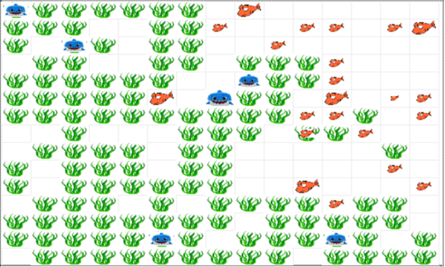

# project-ilona willemse fishtank
This code creates a situation that visualises a fishtank within an animation.




```
The fish move can swim, reproduce and eat algea. They stop eating the algea when they are full. Algea can expand it's population by appearing randomly by chance. Big fish are added which eat the smaller fish. Both fish have the ability to grow as they get older.
```

## How to run

```
$ python3 fish.py
```

# General idea

- Fish
    - [x] swim in a fishtank.
    - [x] through swimming energy level goes down
    - [x] energy can be obtained by eating algea.
    - [x] with energy fish can mate and bare children.
    - [x] fish die when no more energy
    - [x] add age component

- algea
    - [x] can grow randomly by chance which is affected by the light strength.
    - [x] number gets reduced by fish that eat algea.

- input
    - [x] light strenght

- [x] the more fish, the less algea.
- [x] the less algea the less food for the fish, so no mating.

- optional
    - [x] different species of fish
    - [x] fish grow when they age
    - [x] different kinds of fish that only mate with the same species.

- end goal
    - [] visualise how fish populations are influenced by light strength

- addition
    - [x] try visualising the animated plot at the same time as the animation, that would be super cool

- research question: what influence does the light strength have on the population of fish in a fishtank?

## libraries
```
- numpy
- matplotlib.pyplot to plot the data in an image
- matplotlib.animation to visualize the animation
- random to generate a random number to implement some chances
- matplotlib
- copy to copy some grids
- pandas to transform some data for visualization
- mesa 
- shutil 
- matplotlib.offsetbox
```

## limitations that could come up
- not being able to insert an image inside the animation instead of a square
- not being able to let the fish grow
- adding the slides can be tough
- because i cannot use plt.show() it will be hard to visualize the animation if i let it run forever

## inspiration
```
https://docplayer.nl/161846295-Agent-based-modeling-domein-r-computational-science.html

I'd like to implement 2 different fish species if possible
also i might add a male vs female componend

mesa advanced tutorial
```
